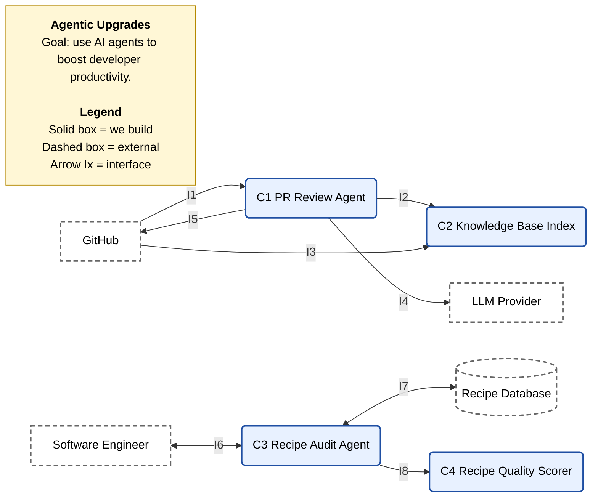
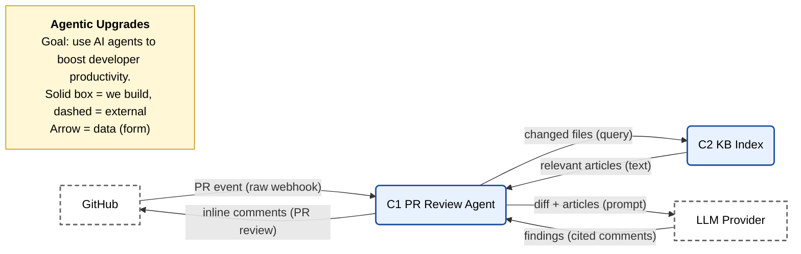
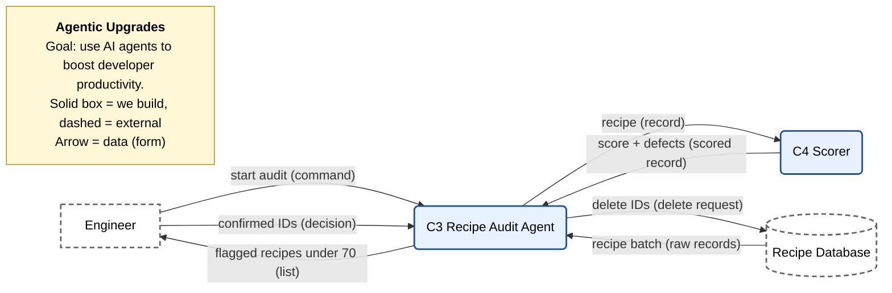

# D0 High-Level Design

**Team:** GE Appliances, a Haier Company
**Team members:** Dan Nassirharand, Maxwell Blevins

---

## 1. Title, Goal Statement, and Conventions

**Project title:** GE Appliances, a Haier Company: Agentic Upgrades

**Goal statement:** Use AI agents to boost developer productivity, enabling the organization to deliver user features of higher quality and quantity.

**Basic input:** A pull request opened on a protected branch, and an engineer's request to audit the recipe database.

**Basic output:** Review comments on the pull request that cite knowledge base articles, and a list of low-quality recipes that the engineer confirms for deletion.

**Conventions:** Solid boxes are components we build. Dashed boxes are external systems or people. Arrows show data flowing between them and are labeled with an interface ID (I1, I2, ...) from part 4.

---

## 2. Block Diagram (D0)



---

## 3. Component Responsibility Table

| ID | Component | Responsibility | Interfaces in | Interfaces out | Owner |
| --- | --- | --- | --- | --- | --- |
| C1 | PR Review Agent | Posts review comments on a pull request, each citing a knowledge base article. | I1, I2, I4 | I2, I4, I5 | Dan |
| C2 | Knowledge Base Index | Returns the knowledge base articles relevant to a pull request's changed files. | I2, I3 | I2 | Dan |
| C3 | Recipe Audit Agent | Flags low-scoring recipes and deletes the ones the engineer confirms. | I6, I7, I8 | I6, I7, I8 | Maxwell |
| C4 | Recipe Quality Scorer | Scores a recipe from 0 to 100 against the quality ruleset. | I8 | I8 | Maxwell |

---

## 4. Interface Specification Table

| ID | From → To | Inputs | Outputs | Format | Protocol | On error (handler) |
| --- | --- | --- | --- | --- | --- | --- |
| I1 | GitHub → C1 | `pr_number`: int, `repo`: string, `head_sha`: string | none | JSON | HTTPS webhook | Invalid event is ignored and logged (C1). |
| I2 | C1 ↔ C2 | `changed_files`: string[] | `articles`: {`id`: string, `text`: string}[] | JSON | HTTPS | Index unavailable: PR is labeled "knowledge base unavailable - manual review required" and the author is notified (C1). |
| I3 | GitHub → C2 | `repo`: string | `docs`: markdown[] | Markdown | GitHub REST API | Sync fails: keep the last good index and retry later (C2). |
| I4 | C1 ↔ LLM | `diff`: string, `articles`: object[] | `findings`: {`file`: string, `line`: int, `text`: string, `article_id`: string}[] | JSON | HTTPS | Timeout: retry once, then fall back to the manual review label (C1). |
| I5 | C1 → GitHub | `comments`: {`file`: string, `line`: int, `body`: string}[], `label`: string | `review_id`: int | JSON | GitHub REST API | Post fails: retry, then add the manual review label (C1). |
| I6 | Engineer ↔ C3 | `start_audit`, `confirm_ids`: string[] | `flagged`: {`recipe_id`: string, `score`: int, `reason`: string}[] | Text | CLI | Invalid input is rejected and nothing is deleted (C3). |
| I7 | C3 ↔ Recipe DB | `batch_size`: int, `delete_ids`: string[] | `recipes`: {`id`: string, `instructions`: string[], `ingredients`: string[]}[] | JSON | Database SDK | Query takes longer than 30 s: halt, save the last finished batch, and notify the engineer (C3). |
| I8 | C3 ↔ C4 | `recipe`: object | `score`: int, `defects`: string[] | JSON | Function call | Malformed recipe scores 0 with defect "unparseable" (C4). |

**Example payload (I4, LLM response):**

```json
{ "findings": [{ "file": "src/OrderService.java", "line": 42, "text": "Wrap this call in a retry per the team standard.", "article_id": "kb-retry-policy" }] }
```

---

## 5. Data-Flow Diagrams

### Flow A: Pull request review (UC-01)



**Timing:** Comments must be posted within 5 minutes of the PR being created (AC-01.1).

### Flow B: Recipe audit (UC-02)



**Timing:** Each batch query has a 30-second timeout (AC-02.2).

---

## 6. Architecture Pattern and Justification

**Pattern:** **Pipeline** governs the PR review flow (event → retrieve → LLM → post). **Client-server** governs the recipe audit, where the engineer is the client of the audit agent.

| Criterion | Justification |
| --- | --- |
| Fit to the problem | PR review is a fixed sequence of stages. The audit is a request/response exchange with an engineer confirmation step. |
| Team skills | Both members have built Java/Python backend services and AWS integrations. |
| Performance and timing | Both patterns easily meet the 5-minute review and 30-second query limits. |
| Scalability | Load is one team's PRs plus occasional audits, so simple patterns are enough. |
| Hardware constraints | None; this is cloud software. |

This design also follows our Week 3 security constraint: agents get minimal permissions, and the engineer must confirm every deletion.

**Rejected:** **Microservices.** Too much deployment and operations overhead for a two-person team and this load.

---

## 7. Decision Log

| # | Decision | Alternatives | Why chosen |
| --- | --- | --- | --- |
| 1 | Engineer must confirm recipe deletions | Agent deletes automatically | UC-02 requires confirmation, and deletion can't be undone. |
| 2 | Recipe scoring uses fixed rules, not the LLM | LLM scores each recipe | The same recipe always gets the same score, it's testable, and it costs no tokens. |
| 3 | Only relevant knowledge base articles are sent to the LLM | Send the whole knowledge base | Lower token cost, and each comment can cite a specific article. |
| 4 | Two separate agents | One agent handles both use cases | The tasks have different risks and permissions, and each owner can work independently. |
